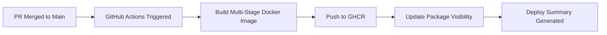

# KBase Note-Taking Application - Architecture Design

## Technology Stack Summary

### Backend

- **Framework**: FastAPI (Python 3.11+)
- **Web Server**: Uvicorn with WebSocket support
- **Database**: SQLite for metadata caching and search indexing
- **Search**: ripgrep (rg) via subprocess + database-backed search
- **File Watching**: watchfiles for detecting filesystem changes
- **Auth**: JWT tokens (httpOnly cookies + localStorage refresh)
- **Config**: PyYAML for config.yaml parsing
- **API Docs**: Auto-generated OpenAPI/Swagger via FastAPI

### Frontend

- **Framework**: Vue 3 (Composition API + TypeScript)
- **State Management**: Pinia
- **Router**: Vue Router
- **Testing**: Vitest + Vue Test Utils
- **Build Tool**: Vite
- **HTTP Client**: Axios
- **UI**: Custom CSS (no component library initially)
- **Code Editor**: Monaco Editor (VS Code editor) for all file types
- **Future**: WebSocket Client, PWA features

### Infrastructure

- **Containerization**: Podman Compose
                                                                - Backend service (FastAPI)
                                                                - Frontend service (Nginx serving built Vue app)
                                                                - Shared volume for note vault
- **Reverse Proxy**: Nginx in frontend container

## Architecture Patterns

### 1. File System Design

```
vault/                           # Mounted Docker volume
├── _attachments/                # Images and media
│   └── {note-name}/            # Organized by source note
│       └── image-{uuid}.png
├── folder-1/
│   ├── note-1.md
│   └── note-2.md
├── folder-2/
│   └── nested/
│       └── note-3.md
└── quick-note.md
```

### 2. Backend API Structure

**REST Endpoints** (`/api/v1/`):

- `POST /auth/login` - Authenticate user and get JWT token
- `GET /auth/verify` - Verify JWT token validity
- `GET /notes` - List all notes (returns tree structure)
- `GET /notes/{path}` - Get note content
- `POST /notes/{path}` - Create note
- `PUT /notes/{path}` - Update note (with conflict detection)
- `DELETE /notes/{path}` - Delete note
- `POST /notes/{path}/move` - Move/rename note
- `POST /notes/{path}/copy` - Copy note 
- `POST /directories/{path}` - Create directory
- `GET /directories/{path}` - Get directory metadata
- `PUT /directories/{path}` - Rename directory
- `DELETE /directories/{path}` - Delete directory
- `POST /directories/{path}/move` - Move directory
- `POST /directories/{path}/copy` - Copy directory
- `GET /notes/search/` - Omni-search (content, fuzzy, with snippets, sorted by modified date)
- `GET /config` - Get public config settings

**WebSocket Endpoint** (`/ws`):

- Pushes file change events: `{type: 'file_changed|created|deleted', path: '...'}`
- Client subscribes after authentication
- **Note**: All endpoints except `/`, `/health`, `/docs`, `/redoc`, `/api/v1/config/` require JWT authentication (unless `DISABLE_AUTH=true`)

### 3. Authentication System

**AuthService** (`backend/app/core/auth.py`):

- JWT token creation and verification
- Plain text password verification (suitable for personal use)
- Bearer token authentication scheme
- FastAPI dependency injection for route protection
- Configurable token expiration (default: 7 days, extended to 30 days with "Remember Me")
- Optional authentication disable via `DISABLE_AUTH` environment variable (for development/local use)

**Auth Endpoints** (`backend/app/api/v1/endpoints/auth.py`):

- `POST /api/v1/auth/login` - Authenticate with password, return JWT token
  - Accepts optional `remember_me` flag for extended token expiration
  - Default token expiration: 7 days (10,080 minutes)
  - With `remember_me=true`: 30 days token expiration
- `GET /api/v1/auth/verify` - Verify token validity
- All other endpoints require valid JWT token in Authorization header (unless `DISABLE_AUTH=true`)

**Config Endpoints** (`backend/app/api/v1/endpoints/config.py`):

- `GET /api/v1/config/` - Get public configuration including authentication status
  - Returns `auth_enabled` boolean indicating if authentication is required
  - Always accessible (no authentication required)
  - Used by frontend to determine authentication requirements

**Persistent Session Management**:

- JWT tokens stored in browser localStorage for persistent sessions
- Token automatically loaded on app initialization
- Token verification on first navigation to restore session state
- Automatic logout on token expiration (401 response)
- Router guard prevents multiple auth initializations
- Session persists across:
  - Page refreshes
  - Browser restarts
  - New tabs/windows (same browser)
  - Until token expiration or explicit logout

**Frontend Authentication Flow**:

1. User logs in with password and optional "Remember Me" checkbox
2. Backend returns JWT token with appropriate expiration (7 or 30 days)
3. Frontend stores token in localStorage (`kbase_token` key)
4. API client automatically attaches token to all requests
5. On app load, router guard calls `initializeAuth()` to verify stored token
6. If token is valid, user is authenticated automatically
7. If token is invalid/expired, user is redirected to login
8. On logout (via logout button in ViewerToolbar), token is removed from localStorage, auth state is cleared, and user is redirected to login page

**Backend Health Monitoring**:

The application includes comprehensive backend connectivity monitoring to provide user feedback when the backend server is unavailable.

**Health Check System** (`frontend/src/composables/useBackendHealth.ts`):
- Monitors backend connectivity status in real-time
- Distinguishes between network errors (backend down) and authentication errors (backend up, invalid token)
- Tracks dismissal state to prevent immediate re-showing of warnings
- Provides manual retry functionality for connection testing
- Auto-dismisses warnings when backend comes back online

**API Client Integration** (`frontend/src/api/client.ts`):
- Response interceptor detects network errors (ECONNREFUSED, ENOTFOUND, ETIMEDOUT, etc.)
- Automatically marks backend as offline for network errors
- Preserves authentication error handling for 401 responses
- Updates health status on successful API responses

**Warning Banner Component** (`frontend/src/components/common/BackendWarning.vue`):
- Fixed position banner at top of page with warning styling (amber/orange theme)
- Shows "Cannot connect to backend server" message with retry button
- Dismissible with X button (stores dismissal timestamp)
- Auto-hides when backend reconnects
- Reappears on next failed request after dismissal (5-second cooldown)
- Responsive design for mobile and desktop

**Integration Points**:
- **Login View**: Shows warning if backend is unreachable during login attempts
- **Main Editor (AppLayout)**: Monitors backend health during normal operation
- **Separate from Auth Errors**: Backend warnings don't replace login-specific error messages
- **Immediate Detection**: Health check runs on page load and during API calls

**Logout Button**:

- Located in the ViewerToolbar at the top right of the application
- Positioned to the right of the Search button
- Icon-based button with door emoji (🚪) and "Logout" text
- Styled consistently with other toolbar buttons (white background, purple hover effect)
- On click, triggers `authStore.logout()` and redirects to `/login` route
- Provides easy access to logout functionality from anywhere in the application

### 4. Core Backend Services

**DatabaseService** (`backend/app/services/db_service.py`):

- SQLite-based metadata cache for performance optimization
- Indexes file tree structure
- Provides fast hierarchical file tree queries
- Auto-rebuilds index when filesystem changes are detected
- Handles large vaults (4000+ files) efficiently

**FileService** (`backend/app/services/file_service.py`):

- CRUD operations on markdown files
- Conflict detection (compare mtime before write)
- Move/rename notes between directories
- Copy notes to new locations
- Attachment management
- Integrates with DatabaseService for metadata caching

**SearchService** (integrated in `backend/app/services/file_service.py`):

- Execute ripgrep for content search with line numbers
- Returns up to 3 matching lines per file with snippets
- Fuzzy, case-insensitive search across file content and filenames
- All space-separated phrases in query must match
- Combines filename matching with content search
- Fallback to Python-based search when ripgrep unavailable

**FileWatcher** (`backend/app/services/file_watcher.py`):

- Use watchfiles to monitor vault directory
- Push events to WebSocket clients
- Debounce rapid changes
- Triggers database index updates

### 4. Frontend Architecture

**Component Structure** (Current Implementation):

```
frontend/src/
├── api/
│   └── client.ts                   # Axios HTTP client with JWT auth
├── composables/
│   ├── useBackendHealth.ts         # Backend connectivity monitoring
│   └── usePWA.ts                   # PWA installation & update management
├── components/
│   ├── common/
│   │   ├── BackendWarning.vue      # Backend connectivity warning
│   │   ├── ConfirmDialog.vue       # Reusable confirmation dialog
│   │   ├── InstallPrompt.vue         # PWA install prompt
│   │   ├── InputDialog.vue         # Reusable input dialog for user input
│   │   ├── OmniSearch.vue          # Modal search interface
│   │   └── UpdatePrompt.vue        # PWA update prompt
│   ├── editor/
│   │   └── MonacoEditor.vue        # Monaco code editor wrapper
│   ├── layout/
│   │   └── AppLayout.vue           # Main layout wrapper
│   ├── sidebar/
│   │   ├── ContextMenu.vue         # Context menu for file operations
│   │   ├── FileExplorerToolbar.vue # Toolbar with New File/Folder/Refresh buttons
│   │   ├── FileTree.vue            # Recursive tree component
│   │   ├── FileTreeNode.vue        # Individual tree node
│   │   └── Sidebar.vue             # Sidebar container
│   └── viewer/
│       ├── NoteViewer.vue          # Note viewer with Monaco editor
│       └── ViewerToolbar.vue       # Toolbar with search and theme controls
├── stores/
│   ├── auth.ts                     # JWT & login state
│   ├── theme.ts                     # Dark mode state
│   └── vault.ts                    # File tree & note update state
├── router/
│   ├── index.ts                    # Route definitions
│   └── guards.ts                   # Auth guards
├── types/
│   └── index.ts                    # TypeScript type definitions
├── utils/
│   ├── highlightSearch.ts          # Search term highlighting
│   └── languageDetection.ts        # File extension to language mapping
└── views/
    ├── LoginView.vue               # Login page
    └── HomeView.vue                # Main app view
```

**Component Structure**:

- **Editor Components**:
  - `MonacoEditor.vue`: Monaco code editor wrapper with auto-save and syntax highlighting for all file types
  - `ViewerToolbar.vue`: Toolbar with search button, logout button, and save status
  - `NoteViewer.vue`: Orchestrates Monaco editor for all file types
- **Layout Components**:
  - `AppLayout.vue`: Main application layout
  - `Sidebar.vue`: File tree sidebar container
  - `FileTree.vue`: Hierarchical file tree display
  - `FileTreeNode.vue`: Individual tree node rendering with drag-and-drop, context menus, and inline rename
  - `FileExplorerToolbar.vue`: Toolbar positioned at top of sidebar with create and refresh actions
- **Common Components**:
  - `BackendWarning.vue`: Dismissible warning banner for backend connectivity issues
  - `ConfirmDialog.vue`: Reusable confirmation modal for destructive actions
  - `InputDialog.vue`: Reusable input dialog with validation for user text input
  - `InstallPrompt.vue`: PWA install prompt with localStorage persistence
  - `ContextMenu.vue`: Right-click context menu with customizable items
  - `OmniSearch.vue`: Modal search interface with content snippets and line numbers
  - `UpdatePrompt.vue`: PWA update notification with reload functionality

**State Management (Pinia)**:

- `authStore`: User session, JWT token management, login/logout
- `vaultStore`: File tree state, selected note, loading states, expanded paths, note updates, save state, sorting preferences
  - **File Operations**: `deleteFile()`, `renameFile()`, `moveFile()`, `createNote()`
  - **Directory Operations**: `deleteDirectory()`, `renameDirectory()`, `moveDirectory()`, `createDirectory()`
  - **Sorting**: `setSortBy()`, `setSortOrder()`, `toggleSortOrder()`, `sortedFileTree` (computed)
    - Supports sorting by name, created date, and modified date
    - Maintains folder-first ordering in all sort modes
    - Sort preferences persisted to localStorage
  - **Tree Navigation**: `collapseAll()`, `hasExpandedPaths` (computed)
  - **UI State**: `isSidebarCollapsed`, `toggleSidebar()`
    - Global sidebar visibility state for collapse/expand functionality
    - Accessible across components for coordinated UI updates
    - **Auto-Expansion**: Vault root (`/`) is automatically expanded on initial load and after collapse operations
      - Ensures first-level files and folders are always visible for better UX
      - Improves discoverability of vault contents without requiring user interaction
    - Collapse all expanded directories with a single action (preserves root expansion)
    - Track expanded state for UI button disable/enable logic
  - All CRUD operations automatically refresh the file tree and handle selection updates
  - `createNote()` automatically opens newly created files in the editor
  - **Persistent Selection**: Stores the last opened note path in localStorage (`kbase_last_note_path`) and automatically reloads it after the file tree syncs, keeping the same editor instance active and highlighted in the sidebar across full page refreshes
  - **Editor State Restore**: Persists per-note cursor selection and scroll offsets for both Monaco and Milkdown editors so that refreshing the browser restores the caret position and viewport exactly where the user left off
- `themeStore`: Dark mode state management, system preference detection, theme persistence
  - **Theme State**: `isDarkMode` reactive boolean tracking current theme
  - **System Preference**: Automatic detection using `matchMedia('prefers-color-scheme: dark')`
  - **Persistence**: User preference stored in localStorage (`kbase_theme_mode`)
  - **Actions**: `toggleTheme()`, `setTheme()`, `initializeTheme()`
  - **System Watcher**: Monitors system preference changes when no user preference exists
  - **Theme Application**: Applies `data-theme` attribute to document root
  - **Monaco Integration**: Monaco editor theme matches app theme (vs-dark in dark mode, vs-light in light mode)
  - **CSS Variables**: Uses CSS custom properties for consistent theming across all components
    - **Variable System**: Light and dark theme variables defined in `App.vue`
    - **Modal Components**: All modals (ConfirmDialog, InputDialog, OmniSearch) use CSS variables
    - **Automatic Switching**: Components automatically adapt when `[data-theme="dark"]` is applied

**Key Features** (Current MVP):

- **Authentication**: JWT-based login with password protection
- **Dark Mode**: Global dark mode with system preference detection
  - **System Preference**: Automatically respects OS dark mode preference on first visit
  - **User Control**: Toggle button in ViewerToolbar (between Search and Logout)
  - **Persistence**: User preference saved in localStorage across sessions
  - **System Sync**: Watches system preference changes when no manual override set
  - **Consistent Theming**: All components use CSS variables for theme switching
    - **Modal Dark Mode**: ConfirmDialog, InputDialog, and OmniSearch fully support dark mode
    - **CSS Variables**: `--bg-primary`, `--bg-secondary`, `--text-primary`, `--text-secondary`, `--border-color`
  - **Monaco Editor**: Theme matches app (vs-dark in dark mode, vs-light in light mode)
  - **Smooth Transitions**: 0.3s ease transitions between theme changes
  - **Toggle Icons**: Moon icon (🌙) in dark mode, sun icon (☀️) in light mode
- **Omni Search**: Fast, comprehensive search across all notes
  - **Modal Interface**: Keyboard-activated search modal (Ctrl+K / Cmd+K)
  - **Content Snippets**: Shows up to 3 matching lines per file with line numbers
  - **Search Highlighting**: Matched search terms highlighted in yellow within snippets
  - **Keyboard Navigation**: Full keyboard support for power users
    - Arrow keys (↑/↓) navigate through results with wrap-around
    - Enter opens the selected result
    - Opening a result auto-expands the file explorer to reveal the note and applies the active selection highlight
    - First result auto-selected when results appear
    - Selection resets to first item on new search
    - Visual indication of selected item with blue highlight
  - **Fuzzy Search**: Case-insensitive, flexible partial matching
  - **Multi-phrase Search**: All space-separated phrases must match
  - **File & Content Search**: Searches both filenames and file contents
  - **Real-time Results**: Debounced search with instant visual feedback
  - **Line Numbers**: Monospace-formatted snippets show exact match locations
  - **XSS Protection**: HTML-escaped content prevents security vulnerabilities
  - **Performance**: Uses ripgrep for fast search, limited to 50 results
  - **Smart Sorting**: Results automatically sorted by last modified date (most recent first)
    - Helps surface recently updated files for better relevance
- **File Explorer**: Advanced file management with full CRUD operations
  - Hierarchical tree view with expand/collapse functionality
    - **Default Expansion**: Vault root is auto-expanded to show first-level items by default
    - Provides immediate visibility of top-level files and folders on page load
    - Collapse All action resets nested directories but preserves first-level visibility
    - **Selection Sync**: Programmatic note selections (e.g., Omni Search) expand ancestor folders, highlight the active file node, and scroll it into view
    - **Directory Item Counts**: Each directory shows total count of nested items (files + subdirectories)
      - Recursive counting of all children at any depth
      - Displayed in lighter color (#9ca3af) with smaller font (0.75rem)
      - Format: `(123)` next to directory name
      - Helps users understand directory size at a glance
  - **File Explorer Toolbar**: Quick access toolbar at the top of the sidebar
    - **New Folder Button**: Create new folders at root level with input validation
    - **New File Button**: Create new markdown files at root level with input validation
    - **Refresh Button**: Manually refresh the file tree (disabled during loading)
    - **Sort Controls**: 
      - **Sort Order Toggle**: Switch between ascending/descending sort order
      - **Sort Criteria Dropdown**: Choose sort method (Name, Created Date, Modified Date)
      - Sort preferences persist in localStorage across sessions
      - Folders always appear before files in sorted results
      - Sorting applies recursively to all nested folders
    - **Collapse All Button**: Quickly collapse all expanded directories
      - Always visible in toolbar (disabled when no directories are expanded)
      - Provides instant reset of tree view to collapsed state
      - Useful for navigating large directory structures
    - Input validation prevents path traversal attacks and invalid characters
    - Auto-appends `.md` extension for new files
  - **Drag & Drop**: Drag files and directories into other directories to move them
  - **Context Menus**: Right-click on files/directories for operations
    - Delete (with confirmation)
    - Rename (inline editing)
    - Move to Root
  - **Inline Rename**: Double-click file/directory names to rename
  - **Delete Confirmation**: Safety dialogs for all delete operations
  - **Recursive Directory Deletion**: Delete directories with all contents (with confirmation)
  - **Input Validation**: All file and folder names validated for security
    - Prevents path traversal (no `../` or absolute paths)
    - Blocks reserved system names (CON, PRN, AUX, etc.)
    - Validates against invalid characters
- **Monaco Editor**: Full-featured code editor with syntax highlighting for all file types
    - Auto-save functionality (1 second debounce)
    - Syntax highlighting for 30+ languages
    - Dark theme matching VS Code
    - Language detection from file extensions
- **Auto-Save**: Automatic saving with visual feedback (saving/saved/error states)
- **Sidebar Toggle**: Collapsible file explorer for maximizing editor space
  - Toggle button in toolbar (left side, before file name)
  - Smooth animation (0.3s ease) for collapse/expand
  - Icon changes direction: `«` (hide) / `»` (show)
  - State managed in vault store for global access
  - Useful for distraction-free writing or small screens
- **Responsive Design**: Clean, modern interface with mobile support
- **Error Handling**: Comprehensive error states and user feedback

**Future Features**:

- **Search Enhancements**: Context lines around matches, jump to line on click, more advanced filtering
- **Performance Optimized**: Handles large vaults (4000+ files) with lazy loading
- **Conflict Resolution**: Modal on save conflict with diff view
- **Image Paste**: Intercept paste events, upload to backend, insert markdown
- **PWA**: Offline viewing of cached notes, background sync

### 5. Configuration System

**Configuration Management** (`backend/app/config.py`):

The application uses Pydantic Settings for type-safe configuration management with environment variables loaded from a `.env` file.

**Required Environment Variables**:
- `VAULT_PATH` - Path to the note vault directory (supports tilde expansion, e.g., `~/kbase-vault`)
- `SECRET_KEY` - Secret key for JWT token signing (required only if authentication is enabled)
- `PASSWORD` - Plain text password for authentication (required only if authentication is enabled)

**Optional Environment Variables**:
- `DISABLE_AUTH` - Disable authentication (defaults to `true` in dev mode, `false` in production)
  - Development mode is detected via: `ENV=development`, `ENVIRONMENT=development`, or `DEBUG=true`
  - Can be explicitly set to override automatic detection
- `HOST` - Server host (default: `0.0.0.0`)
- `PORT` - Server port (default: `8000`)
- `ACCESS_TOKEN_EXPIRE_MINUTES` - Token expiration time (default: `10080` = 7 days)
- `ALGORITHM` - JWT signing algorithm (default: `HS256`)
- `APP_NAME` - Application name (default: `KBase`)
- `APP_VERSION` - Application version (default: `0.1.0`)

**Note**: `SECRET_KEY` and `PASSWORD` are only required when authentication is enabled (`DISABLE_AUTH=false`).

**Configuration Features**:
- **Path Validation**: Vault path is validated at startup to ensure it exists and is a directory
- **Path Expansion**: Supports tilde (`~`) expansion for home directory paths
- **Type Safety**: All configuration values are type-checked using Pydantic
- **Auto-loading**: `.env` file is automatically loaded from the backend directory

**Example `.env` file**:
```bash
VAULT_PATH=~/kbase-vault
SECRET_KEY=your-generated-secret-key-here
PASSWORD=your-secure-password
ACCESS_TOKEN_EXPIRE_MINUTES=30
```

### 6. Podman Compose Setup

```yaml
services:
  backend:
    build: ./backend
    volumes:
      - ${VAULT_PATH}:/vault
    environment:
      - CONFIG_PATH=/app/config.yaml
    ports:
      - "8000:8000"
      
  frontend:
    build: ./frontend
    depends_on:
      - backend
    ports:
      - "80:80"
    environment:
      - VITE_API_URL=http://backend:8000
```

### 7. Key Implementation Details

**Conflict Detection**:

1. Client sends last-known mtime with PUT request
2. Backend compares with current file mtime
3. If different, return 409 Conflict with current content
4. Frontend shows diff modal for user decision

**Real-time Sync Flow**:

1. Backend watchfiles detects change
2. Pushes event via WebSocket to all clients
3. Client checks if file is open in editor
4. If not open, updates file tree
5. If open, shows notification (external change detected)

**Monaco Editor Integration**:

The Monaco editor provides a professional code editing experience with syntax highlighting and auto-save for all file types.

1. **Component Architecture**:
   - `MonacoEditor.vue`: Wraps Monaco editor with Vue lifecycle
   - Lazy-loads Monaco library on component mount
   - Handles editor initialization, content synchronization, and cleanup
   
2. **Auto-Save Implementation**:
   - Debounced save (1000ms delay after last keystroke)
   - Emits `save` event with content to parent component
   - Parent (NoteViewer) calls vault store's `updateNote` action
   - Visual feedback via ViewerToolbar (saving/saved/error states)
   
3. **Language Detection**:
   - Utility function `detectLanguage(filename)` maps extensions to Monaco language IDs
   - Supports 30+ file types (markdown, javascript, python, json, etc.)
   - Falls back to 'plaintext' for unknown extensions
   - Updates language when file path changes
   
4. **Editor Configuration**:
   - Theme: VS Code dark theme (`vs-dark`)
   - Auto-layout enabled for responsive resize
   - Minimap enabled for navigation
   - Word wrap enabled for better readability
   - Tab size: 2 spaces
   - No custom toolbar (Monaco's built-in commands accessible via keyboard shortcuts)
   
5. **Save Status Flow**:
   ```
   User types → Debounce (1s) → Emit 'save' event → 
   NoteViewer sets status='saving' → Call updateNote API →
   Success: status='saved' (2s) → Clear status
   Error: status='error' (5s) → Clear status
   ```

6. **Performance Optimizations**:
   - Monaco library loaded only once and cached
   - Editor instance reused when switching files
   - ResizeObserver for efficient layout updates
   - Automatic cleanup on component unmount

**Milkdown Editor Integration**:

Milkdown provides a WYSIWYG markdown editor as an optional alternative to Monaco for markdown files.

1. **Component Architecture**:
   - `MilkdownEditor.vue`: Wraps Milkdown editor with Vue lifecycle
   - Uses Milkdown core with CommonMark and GFM presets
   - Nord theme for consistent styling
   - Matches MonacoEditor interface for seamless integration
   
2. **Editor Selection**:
   - Editor preference stored per file type in `editorStore` (localStorage)
   - Default: Monaco (for backward compatibility)
   - Milkdown only available for markdown (.md) files
   - Non-markdown files always use Monaco
   - Toggle button in ViewerToolbar (toolbar-center) for markdown files
   
3. **Auto-Save Implementation**:
   - Same debounced save pattern as Monaco (1000ms delay)
   - Emits `save` event with markdown content
   - Milkdown natively saves as markdown (no conversion needed)
   - Uses same save status UI as Monaco
   
4. **Editor Configuration**:
   - Presets: CommonMark (standard markdown) + GFM (GitHub Flavored Markdown)
   - Theme: Nord theme with dark/light mode support
   - Responsive design with mobile optimizations
   - CSS variables for theme integration
   - Tab Indentation: Tab key indents selected lines/blocks, Shift+Tab outdents
     - Lists: Uses native `@milkdown/plugin-indent` plugin for list items
     - Regular Text: Custom plugin for paragraph indentation (2 spaces per level)
     - Works with markdown syntax (lists, code blocks, paragraphs)
   
5. **Content Synchronization**:
   - Watches for external content changes
   - Updates editor when modelValue changes
   - Prevents infinite update loops
   
6. **Editor Store** (`stores/editor.ts`):
   - Manages editor preference: `'monaco' | 'milkdown'`
   - Persists to localStorage: `kbase_editor_preference`
   - `getEditorForFile(path)`: Returns appropriate editor for file type
   - `toggleMarkdownEditor()`: Switches between Monaco and Milkdown
   - `canUseMilkdown(path)`: Checks if file can use Milkdown

7. **Empty Document Handling**:
   - The Milkdown container uses a flex layout and ProseMirror `focus` action to keep the editor interactive even when a markdown file is completely empty.
   - Container pointer listeners redirect clicks and taps to Milkdown, removing the need for placeholder content in newly created notes.

**File Explorer CRUD Operations**:

The file explorer provides comprehensive file and directory management through an intuitive user interface.

1. **Drag & Drop Implementation**:
   - Native HTML5 drag-and-drop API
   - Visual feedback during drag operations (opacity change on dragging item, border highlight on drop target)
   - Drag any file or directory onto a target directory to move it
   - Prevents invalid operations (dropping on self, dropping parent into child)
   - Automatically refreshes file tree after successful drop
   - Uses JSON data transfer for cross-browser compatibility
   - **Auto-Expand Feature**:
     - Collapsed directories automatically expand after hovering for 600ms during drag
     - Timer is cancelled if drag leaves the directory before 600ms
     - Directories expand immediately upon successful drop if still collapsed
     - Timer cleanup on drag end prevents memory leaks
     - Only directories are auto-expanded; files are ignored
   
2. **Context Menu System**:
   - Right-click on any file or directory to open context menu
   - Context menu positioned at cursor with automatic viewport boundary detection
   - Click-outside or ESC key to close
   - Menu items:
     - **Rename**: Activates inline rename mode
     - **Move to Root**: Moves item to vault root directory
     - **Delete**: Shows confirmation dialog (styled as dangerous action)
   - Menu items styled with icons for better UX
   
3. **Inline Rename**:
   - Double-click any file/directory name to activate rename mode
   - Input field replaces name with current value pre-filled
   - Smart text selection (excludes file extension for files)
   - Confirm with Enter key, cancel with ESC key or blur
   - Validates new name before submission
   - Automatically refreshes file tree and updates selection after rename
   
4. **Delete Confirmation**:
   - Reusable `ConfirmDialog` component for all delete operations
   - Different messages for files vs directories
   - Directories: Warns about recursive deletion of all contents
   - Styled as dangerous action (red button)
   - Keyboard shortcuts: ESC to cancel, Enter to confirm
   - Prevents accidental deletions with clear messaging
   
5. **API Client Integration**:
   - Dedicated methods for all CRUD operations
   - `deleteFile()`, `renameFile()`, `moveFile()` for file operations
   - `deleteDirectory()`, `renameDirectory()`, `moveDirectory()`, `createDirectory()` for directory operations
   - Proper error handling with user-friendly error messages
   - Automatic path encoding for URL safety
   
6. **Vault Store CRUD Actions**:
   - All operations integrated into vault store for centralized state management
   - Automatic file tree refresh after any CRUD operation
   - Smart selection handling:
     - Clear selection if deleted file was selected
     - Update selection if renamed file was selected
     - Clear selection if it was inside a moved/deleted directory
   - Error state management with descriptive error messages
   - Loading state management for better UX

## Security Considerations

1. **Path Traversal**: Validate all file paths to prevent `../` attacks
   - DirectoryService validates paths to ensure they stay within vault directory
   - Checks for `../` and `..\\` patterns to prevent directory traversal
   - Allows absolute paths starting with `/` within the vault scope
   - Uses `os.path.commonpath()` to verify paths remain within vault boundaries
2. **JWT Security**: 
   - Bearer tokens stored in browser localStorage
   - Default token expiration: 7 days (10,080 minutes)
   - Extended expiration with "Remember Me": 30 days
   - Tokens automatically verified on app initialization
   - Expired tokens trigger automatic logout and redirect to login
   - Suitable for personal use; consider httpOnly cookies for multi-user environments
3. **Password Security**: Plain text storage in environment variables (suitable for personal use)
4. **File Upload**: Validate image types, size limits, sanitize filenames
5. **CORS**: Configure properly for frontend-backend communication
6. **Token Validation**: All protected endpoints validate JWT tokens
7. **Session Persistence**: Tokens persist across page refreshes and browser restarts until expiration

## PWA Features

KBase is a fully functional Progressive Web App (PWA) that can be installed on mobile devices and desktop browsers, providing native app-like experiences with offline capabilities.

### Service Worker Strategy

**Caching Strategy** (`frontend/vite.config.ts`):
- **Register Type**: Prompt-based installation (user-initiated)
- **Static Assets**: CacheFirst strategy for JS, CSS, images, fonts
  - Cache: 1 year (immutable)
  - Fallback: Network first, then cache
- **API Endpoints**: NetworkFirst strategy with 5-minute cache
  - Cache: 50 entries, 5 minutes expiration
  - Benefits: Offline access to recently loaded notes

**Workbox Configuration**:
```typescript
workbox: {
  globPatterns: ['**/*.{js,css,html,ico,png,svg,woff2}'],
  runtimeCaching: [
    {
      urlPattern: /^https:\/\/fonts\.googleapis\.com\/.*/i,
      handler: 'CacheFirst',
      cacheName: 'google-fonts-cache'
    },
    {
      urlPattern: /\/api\/v1\/.*/i,
      handler: 'NetworkFirst',
      cacheName: 'api-cache'
    }
  ]
}
```

### Manifest Configuration

**Web App Manifest** (`frontend/public/manifest.json`):
- **Name**: "KBase Note-Taking Application"
- **Short Name**: "KBase"
- **Display Mode**: standalone (native app feel)
- **Theme Color**: #667eea (purple)
- **Background Color**: #f8fafc (light mode)
- **Orientation**: any (supports all orientations)
- **Icons**: 192x192 and 512x512 maskable icons

### Installation & Updates

**Install Prompts** (`frontend/src/composables/usePWA.ts`):
- Automatic install prompt detection via `beforeinstallprompt` event
- Smart dismiss logic: 1-week cooldown after dismissal
- Platform-specific handling (iOS, Android, Desktop)
- Visual prompts via `InstallPrompt.vue` component

**Update Management**:
- Service worker update detection
- Visual update notification via `UpdatePrompt.vue` component
- One-click update with automatic reload
- Skip option for non-critical updates

### Offline Support

**Offline Capabilities**:
- Cached static assets load instantly offline
- Recently loaded notes accessible offline (5-minute cache)
- Network status monitoring via `navigator.onLine`
- Graceful degradation when offline
- Queue edits for sync when connection restored (future feature)

### Mobile Responsiveness

**Mobile Optimizations** (`frontend/src/components/*`):
- **Sidebar**: Side-by-side layout on mobile (< 768px)
  - 240px fixed width when open
  - Maintains inline flex layout for both panes visibility
  - Slides out left when collapsed (translateX(-100%))
  - Touch-friendly 44px minimum touch targets
- **Monaco Editor**: Mobile-optimized settings
  - Disabled line numbers on mobile
  - Disabled minimap on mobile
  - Disabled context menu on mobile
  - Reduced line decorations width
- **Toolbar**: Compact layout on mobile
  - Icon-only buttons
  - Truncated file names
  - Responsive button sizes
- **OmniSearch**: Full-screen modal on mobile
  - Full-width modal with rounded top corners
  - Larger touch targets (56px minimum)
  - iOS 16px font size to prevent zoom

**Safe Area Insets**:
- Support for notched devices (iPhone X+)
- Dynamic padding based on device safe areas
- Uses CSS `env(safe-area-inset-*)` variables

### PWA Components

**InstallPrompt.vue** (`frontend/src/components/common/InstallPrompt.vue`):
- Banner-style install prompt
- Dismissible with localStorage persistence
- Platform-specific messaging
- Slide-up animation

**UpdatePrompt.vue** (`frontend/src/components/common/UpdatePrompt.vue`):
- Top-aligned update notification
- Update and Skip actions
- Smooth animations

**usePWA Composable** (`frontend/src/composables/usePWA.ts`):
- Centralized PWA logic
- Installation detection
- Update management
- Offline status monitoring

## Testing Strategy

- **Backend**: pytest with test vault fixtures (comprehensive coverage)
- **Frontend**: Vitest + Vue Test Utils (92+ tests passing, 87% coverage)
- **E2E Tests**: Playwright with comprehensive authentication flow coverage
- **Unit Tests**: All stores, components, and API client
- **Component Tests**: User interactions, error states, conditional rendering
- **Integration Tests**: Full user workflows with real backend integration

### E2E Testing Infrastructure

**Playwright Configuration**:
- Multiple browser support (Chromium, Firefox, WebKit)
- Mobile testing (Mobile Chrome, Mobile Safari)
- Parallel execution with isolated test contexts
- Screenshot/video capture on failure
- CI/CD integration with GitHub Actions

**Test Coverage**:
- **Authentication Flows**: Login success/failure, logout, token persistence
- **Route Guards**: Protected route access, redirects
- **Security Testing**: SQL injection, XSS prevention, input validation
- **Edge Cases**: Network failures, concurrent requests, storage disabled
- **UI/UX Validation**: Loading states, form validation, accessibility

**Test Architecture**:
- **Page Object Model**: Maintainable, reusable test patterns
- **Isolated Test Environment**: Dedicated test vault with fixtures
- **Backend Management**: Automated server startup/teardown
- **Helper Utilities**: Auth helpers, vault management, backend control

**Test Execution**:
- **Local Development**: `npm run test:e2e` with UI mode for debugging
- **CI/CD**: Automated testing on push/PR with artifact upload
- **Parallel Execution**: 3-4x faster test execution
- **Cross-browser**: Ensures compatibility across all supported browsers

## Performance Optimizations

1. **Database Caching**: SQLite-based metadata cache for file tree
2. **Lazy Loading**: File explorer shows 100 files initially with "Show More" button
3. **Search/Filter**: Real-time filtering to reduce DOM rendering load
4. **Debounced Search**: Wait for user to stop typing
5. **WebSocket Reconnection**: Exponential backoff
6. **Optimized API**: Uses cached database instead of filesystem scanning
7. **Memory Management**: 40x reduction in memory usage for large vaults
8. **Directory Item Counting**: Recursive counting computed on-demand in Vue components
   - Uses computed properties for reactive updates
   - Counting happens client-side during tree rendering
   - Efficient for typical vault sizes (< 5000 files)
   - Minimal performance impact due to Vue's caching mechanism
9. **Search Result Sorting**: Results sorted by modified date on backend
   - Sorting done once before sending to frontend
   - No additional frontend processing needed
   - Helps surface most relevant (recent) files first

### Performance Benchmarks

- **API Response Time**: 5-10 seconds → 50-100ms (50-100x faster)
- **UI Load Time**: 10+ seconds → <1 second (10x faster)  
- **Memory Usage**: 40x reduction with lazy loading
- **Large Vault Support**: Tested with 4000+ files

## Deployment Architecture

### Docker Containerization

KBase is deployed as a single Docker container containing both frontend and backend services, optimized for production deployment.

**Container Structure**:

```
kbase-container/
├── /app/
│   ├── backend/              # FastAPI application
│   │   ├── app/              # Python application code
│   │   ├── requirements.txt  # Python dependencies
│   │   └── pyproject.toml   # Project configuration
│   └── dist/                 # Built frontend assets
│       ├── index.html        # SPA entry point
│       ├── assets/           # CSS, JS, images
│       └── favicon.ico       # App icon
└── /app/vault/               # Mounted volume for notes
```

**Multi-Stage Build Process**:

1. **Frontend Builder Stage** (`node:18-alpine`):
   - Installs Node.js dependencies
   - Builds Vue.js frontend with Vite
   - Outputs optimized static assets to `/app/frontend/dist`

2. **Production Stage** (`python:3.11-slim`):
   - Installs Python dependencies with uv
   - Copies built frontend assets to `/app/dist`
   - Configures FastAPI to serve static files
   - Creates non-root user for security
   - Exposes port 8000

**Static File Serving**:

- FastAPI serves frontend assets at root path (`/`)
- API routes (`/api/v1/*`) take precedence over static files
- SPA routing handled by serving `index.html` for non-API routes
- Assets served from `/assets/` path for optimal caching

### CI/CD Pipeline

**GitHub Actions Workflow** (`.github/workflows/docker-publish.yml`):

1. **Trigger**: Push to `main` branch (when PRs merge)
2. **Build Process**:
   - Checkout code
   - Set up Docker Buildx for multi-platform builds
   - Login to GitHub Container Registry (GHCR)
   - Extract metadata and generate tags
   - Build and push Docker image

3. **Image Tagging Strategy**:
   - `latest`: Always points to latest main branch
   - `sha-{commit-hash}`: Specific commit for reproducibility
   - Multi-platform: `linux/amd64` and `linux/arm64`

4. **Registry Configuration**:
   - **Registry**: `ghcr.io` (GitHub Container Registry)
   - **Visibility**: Public (anyone can pull)
   - **Authentication**: Uses `GITHUB_TOKEN` automatically
   - **Permissions**: `packages: write`, `contents: read`

**Deployment Workflow**:



### Production Deployment

**Container Configuration**:

```yaml
# docker-compose.yml
version: '3.8'
services:
  kbase:
    image: ghcr.io/yourusername/kbase:latest
    container_name: kbase
    ports:
      - "8000:8000"
    volumes:
      - ./vault:/app/vault
    environment:
      - VAULT_PATH=/app/vault
      - SECRET_KEY=your-secret-key
      - PASSWORD=your-password
    restart: unless-stopped
    healthcheck:
      test: ["CMD", "curl", "-f", "http://localhost:8000/health"]
      interval: 30s
      timeout: 10s
      retries: 3
```

**Required Environment Variables**:

| Variable | Required | Description | Example |
|----------|----------|-------------|---------|
| `VAULT_PATH` | Yes | Path to notes directory inside container | `/app/vault` |
| `SECRET_KEY` | Yes | JWT signing key | `a1b2c3d4e5f6...` |
| `PASSWORD` | Yes | Login password | `my-secure-password` |
| `ACCESS_TOKEN_EXPIRE_MINUTES` | No | Token expiration (default: 10080) | `10080` |
| `HOST` | No | Server host (default: 0.0.0.0) | `0.0.0.0` |
| `PORT` | No | Server port (default: 8000) | `8000` |

**Security Considerations**:

- **Non-root User**: Container runs as `kbase` user for security
- **Health Checks**: Built-in health monitoring via `/health` endpoint
- **Volume Mounts**: Vault directory mounted as volume for data persistence
- **Environment Variables**: Sensitive data passed via environment variables
- **Network Security**: Container exposes only port 8000

**Production Recommendations**:

1. **Reverse Proxy**: Use nginx or traefik for HTTPS termination
2. **SSL/TLS**: Configure SSL certificates for secure communication
3. **Backups**: Regular backups of vault directory
4. **Updates**: Pull new images regularly for security updates
5. **Monitoring**: Set up logging and monitoring for container health
6. **Resource Limits**: Configure CPU and memory limits for container

**Scaling Considerations**:

- **Single Instance**: Current architecture designed for single-user deployment
- **Data Persistence**: Vault directory must be shared across container restarts
- **Session Management**: JWT tokens stored client-side (no server-side session state)
- **File Locking**: No built-in file locking for concurrent access
- **Future Scaling**: Architecture supports horizontal scaling with shared storage

